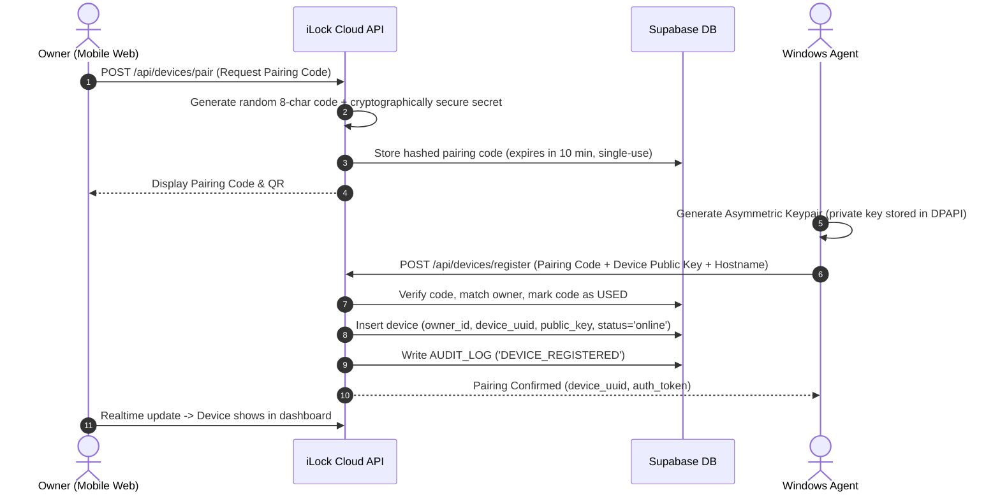
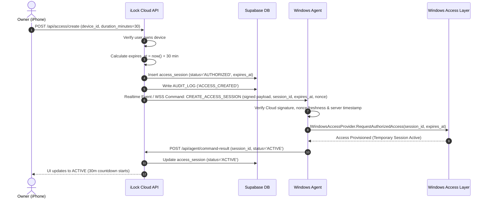
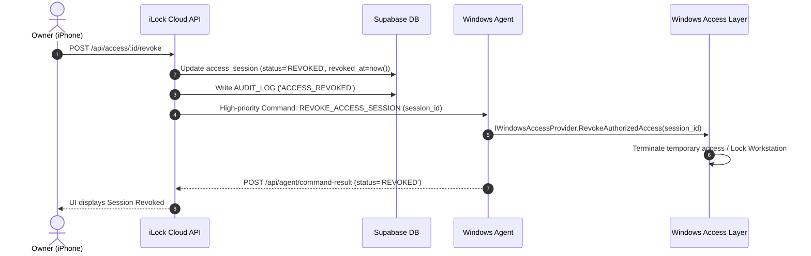
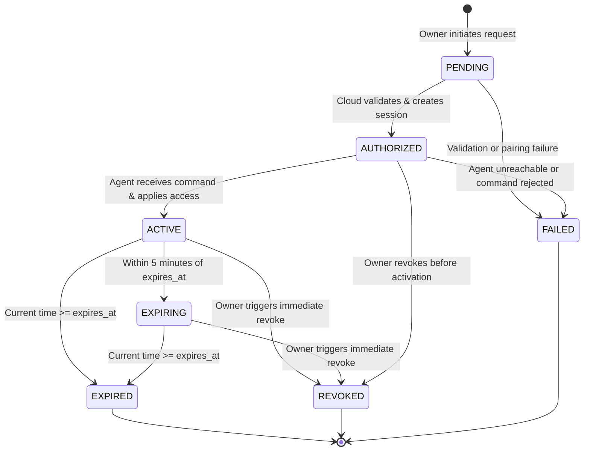

# iLock — System Architecture & Design Specification

## 1. Executive Summary

**iLock** is a production-grade, full-stack remote PC access and temporary authorization system. It enables a Windows PC owner to securely grant short-lived, verifiable, and remotely revocable access to their computer from any mobile browser or progressive web app (PWA), regardless of network boundaries (NAT, cellular, home Wi-Fi, college campus networks), **without ever storing, transmitting, or requesting the user's actual Windows password or compromising OS security primitives**.

---

## 2. High-Level Architecture Topology

```
┌────────────────────────────────────────────────────────┐
│             Remote Owner (iPhone / PWA / Web)           │
│  - Next.js 14/15 Responsive UI, Tailwind CSS, Lucide   │
│  - Supabase Auth (Email/Pass, MFA-ready, WebAuthn-prep) │
│  - Biometric Confirmation / Instant Revoke UI          │
└───────────────────────────┬────────────────────────────┘
                            │
                       HTTPS (TLS 1.3)
                            │
                            ▼
┌────────────────────────────────────────────────────────┐
│               Cloud API & Application Layer            │
│  - Vercel Serverless / Next.js Route Handlers          │
│  - Zod Input Validation & Schema Enforcement           │
│  - Token / Pairing Cryptographic Verifier             │
│  - In-Memory / Edge Rate Limiting & Anti-Brute-Force   │
│  - Audit Logging & Security Event Triggers             │
└───────────────────────────┬────────────────────────────┘
                            │
                   Postgres RLS / Realtime
                            │
                            ▼
┌────────────────────────────────────────────────────────┐
│            Persistence & Realtime Hub (Supabase)       │
│  - PostgreSQL with Row Level Security (RLS)            │
│  - Device Registry, Identity Keys (Public Only)       │
│  - Ephemeral Pairing Tokens (Hashed, Single-Use)       │
│  - Access Session State Machine                        │
│  - Realtime WebSocket Command Broadcasts               │
└───────────────────────────┬────────────────────────────┘
                            │
           Outbound WSS / HTTPS (Long Polling / Events)
             (PC initiates outward; No open inbound ports)
                            │
                            ▼
┌────────────────────────────────────────────────────────┐
│                iLock Windows Service / Agent           │
│  - .NET 8 / C# Windows Background Service              │
│  - Device Cryptographic Identity (Local Private Key)   │
│  - Windows DPAPI Secure Storage                        │
│  - Outbound Connection Manager + Backoff Reconnect     │
│  - Cryptographic Command Verifier & Nonce Cache        │
│  - Session Lifecycle Engine (Server Time Drift Sync)   │
│  - `IWindowsAccessProvider` (Demo Mode & OS Hook)      │
└───────────────────────────┬────────────────────────────┘
                            │
                            ▼
┌────────────────────────────────────────────────────────┐
│                 Windows Security Layer                 │
│  - Windows Credential Provider / Local Account API     │
│  - Workstation Lock / Winlogon Integration             │
│  - Safe Demo / Sandbox Isolation Provider              │
└────────────────────────────────────────────────────────┘
```

---

## 3. Core Principles & Security Invariants

1. **Zero Windows Password Disclosure**:
   The user's actual Windows login password is never requested, transmitted, cached, or stored anywhere in the cloud or in the web application.
2. **Asymmetric Device Identity**:
   Every PC generates an asymmetric key pair (RSA-4096 or ECDSA P-256) locally upon initial pairing. The private key never leaves the PC's secure local storage (protected via Windows DPAPI). Only the public key is registered with the cloud backend.
3. **Outbound-Only Connectivity**:
   The Windows PC communicates strictly via outbound HTTPS and WebSocket connections. It never exposes listening ports to the local network or the Internet, negating NAT traversal, firewall hole-punching, or dynamic DNS risks.
4. **Server-Enforced Ephemerality**:
   Access expiration is authoritative on the cloud backend and continually cross-validated on the agent. Client clocks can never prolong an authorized session.
5. **State Machine Integrity**:
   Session status transitions are strictly governed by an immutable state transition graph (`PENDING` → `AUTHORIZED` → `ACTIVE` → `EXPIRING` → `EXPIRED` / `REVOKED` / `FAILED`).
6. **Legitimate Windows Security Integration**:
   No credential dumping, no LSASS injection, no unauthorized registry tampering. Production systems integrate via legitimate Windows Credential Provider architectures, Winlogon APIs, or temporary local guest account management with explicit quotas.

---

## 4. System Components

### 4.1. Web Application (`apps/web`)
- **Framework**: Next.js (App Router), React, TypeScript (strict mode).
- **Styling**: Tailwind CSS with dark-mode first design system (shadcn/ui aesthetic).
- **PWA Support**: Web App Manifest, Service Worker offline caching for application shell, Apple mobile web app capability for fullscreen mobile execution.
- **Client Features**:
  - Device list with live health status (Online, Offline, Connecting, Authentication Error).
  - One-click temporary access generator (preset durations: 15m, 30m, 1h, 2h, Custom).
  - Immediate kill-switch / session revocation.
  - Interactive device pairing flow with short-lived pairing tokens and QR code rendering.
  - Comprehensive Audit Log & Security Events viewer.
  - Simulation / Demo Mode toggle for testing without requiring a dedicated Windows physical machine.

### 4.2. Shared Core (`packages/shared`)
- Canonical TypeScript schemas and types used across web, APIs, and client runtimes.
- Zod schemas for all command payloads, pairing requests, heartbeat packets, and status updates.
- State machine transition validators.
- Cryptographic utility wrappers (HMAC, SHA-256, signature formats, nonce generation).

### 4.3. Windows Agent (`services/windows-agent`)
- **Technology**: C# / .NET 8 Worker Service + Cross-Platform Node CLI Runner for testing.
- **Components**:
  - `DeviceIdentityManager`: Generates and manages the local asymmetric key pair. Uses Windows Data Protection API (`ProtectedData`) on Windows.
  - `CloudConnectionClient`: Handles outbound WebSocket (Supabase Realtime) and REST API communication with exponential backoff and automatic jitter.
  - `HeartbeatWorker`: Sends cryptographically signed heartbeats every 30 seconds (configurable) to keep connection state fresh.
  - `CommandDispatcher`: Receives remote commands (`LOCK`, `CREATE_ACCESS_SESSION`, `REVOKE_ACCESS_SESSION`, `PING`, `GET_STATUS`), verifies signatures, nonces, and timestamps, and routes them to the access provider.
  - `IWindowsAccessProvider`: Abstraction layer separating cloud logic from OS access control:
    - `WindowsAccessProvider`: Production implementation interfacing with Windows OS security.
    - `DemoAccessProvider`: Safe sandbox implementation simulating lock/unlock, temporary token provisioning, and notification alerts without OS tampering.

### 4.4. Database & Backend Services (`supabase`)
- PostgreSQL with Row Level Security (RLS) enabled on all tables.
- Tables:
  - `profiles`: User account data.
  - `devices`: Registered machines, public keys, online status, agent version.
  - `pairing_requests`: Ephemeral pairing tokens with single-use and rate-limited lifecycles.
  - `access_sessions`: Temporary authorization records with start/expiry/revocation timestamps and state tracking.
  - `audit_logs`: Immutable security audit log tracking logins, pairing, access grants, revokes, and connection anomalies.
  - `device_status`: Real-time telemetry, IP hash, battery/power state, OS details.
  - `security_events`: High-priority alert logs (e.g., signature verification failures, replay attempts, expired command attempts).

---

## 5. Sequence Flows & Protocols

### 5.1. Device Pairing Protocol


### 5.2. Temporary Access Grant & Verification Flow


### 5.3. Immediate Revocation Flow


---

## 6. Access State Machine



---

## 7. Replay & Time Synchronization Security

1. **Nonce Registry**: Every command issued by the cloud embeds a single-use UUIDv4 nonce and an authoritative UTC timestamp. The Windows Agent maintains an in-memory + sliding-window persistent cache of processed nonces. Any command with an already observed nonce or a timestamp skewed by > 120 seconds is instantly rejected and flagged as a `SECURITY_EVENT`.
2. **Server-Enforced Expiration**: Even if an attacker manipulates the local PC system clock, the agent continuously heartbeats with the cloud API, which returns authoritative epoch time. If drift is detected or a session is marked `EXPIRED` on the server, the agent immediately terminates the session.
3. **Heartbeat Liveness**: A device is marked `OFFLINE` if no heartbeat is received within 90 seconds (3 consecutive missed heartbeat intervals). Commands cannot be queued indefinitely for an offline device; unacknowledged commands expire after 60 seconds.

---

## 8. Development & Demo Strategy

To ensure this project is fully runnable and verifiable by anyone without requiring a domain controller or risking real Windows OS lockout:
1. **Interactive Demo Mode**: Both the Web UI and the Agent include an explicit, visually distinct Demo Mode.
2. **Pluggable Access Provider**: The Windows Agent implements `IWindowsAccessProvider`. On a standard machine, it runs with `DemoAccessProvider` which simulates session locking, temporary credentials, and access countdowns with full real-time telemetry. In a production deployment, `WindowsAccessProvider` hooks into Windows APIs.
3. **Cross-Platform Agent Runner**: Alongside the .NET 8 Windows Service source code, a TypeScript/Node Agent Runner is provided to enable seamless local end-to-end testing of pairing, heartbeats, and commands on any OS.
